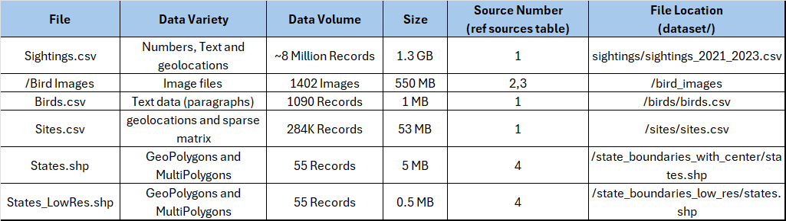
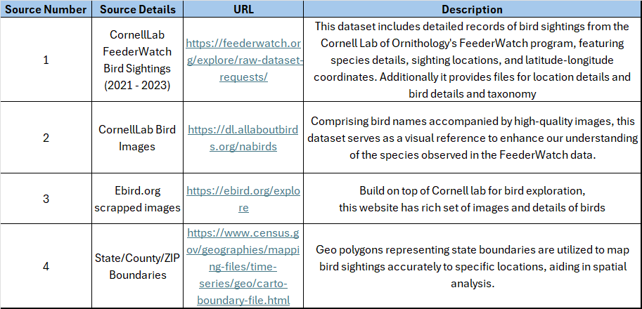
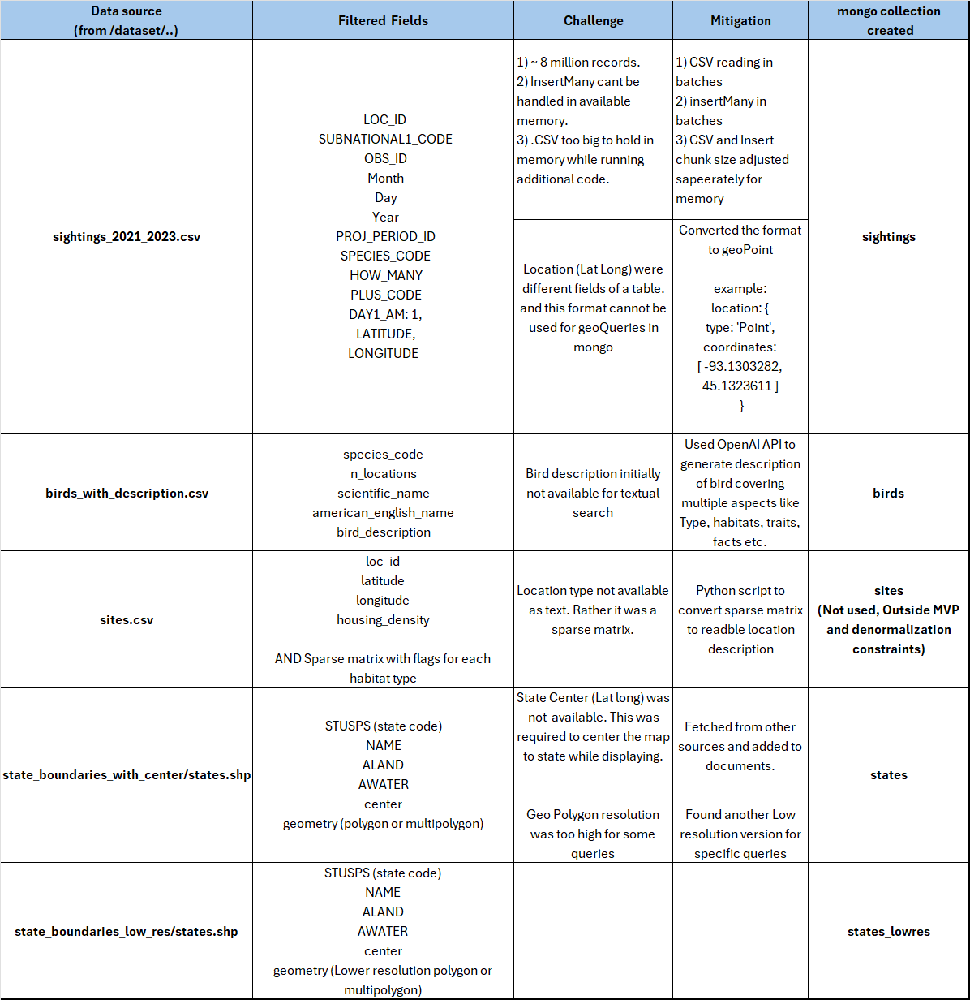
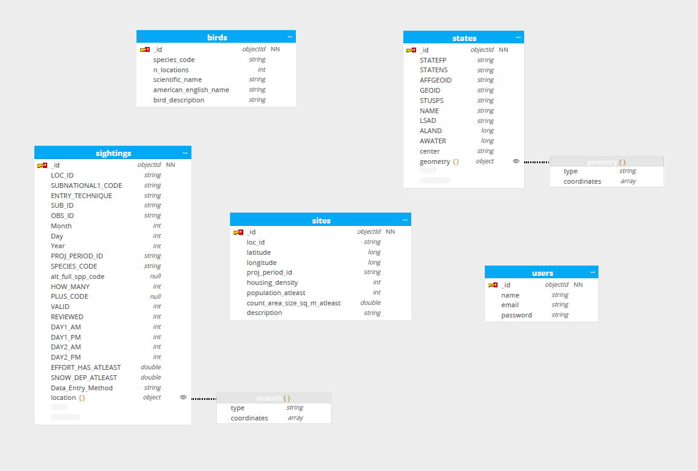
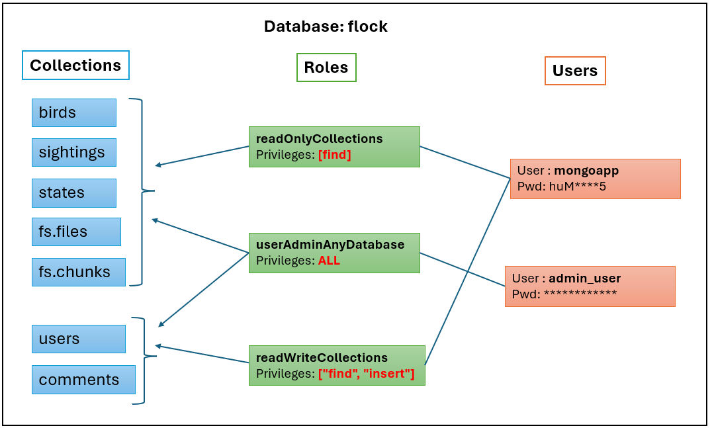

# Flock & Roll

Welcome to Flock & Roll's GitHub repository! Our team is dedicated to leveraging the power of data to enhance our understanding of bird sightings across various locations from USA. Through meticulous analysis and innovative techniques, we aim to uncover patterns and insights that contribute to the broader field of ornithology and data science.

## Team Members

- **Poorna Chander Reddy, Puttaparthi** (`@poorna-chander`)
- **Omkar Sandip, Chavan** (`@comkar893`)
- **Divya Dilip, Hinge** (`@divyahinge17`)
- **Onkar Eknath, Shelar** (`@Onkar2102`)

## About The Project

Our project focuses on analyzing bird sighting data from multiple sources to draw meaningful insights into bird species' migration patterns, population densities, and habitat preferences. By combining traditional data analysis methods with modern data science techniques, we aim to contribute valuable information to the birdwatching community and wildlife conservation efforts.

## Datasets

We utilize three primary datasets in our analysis:

### Dataset Details 

### Data Sources 

## Data processing and insertion:

Data processing and insertion scripts can be found in `/scripts/data_insertion/`

### Data Processing: 

The following table summarizes the data processing and insertion details. it also covers the challenges faced and how they were mitigated. the script that performs the data insertion is present at `scripts/data_insertion/data_insertion.py`

### Image Processing:

## Database Schema:

## Mongo Queries:

## Mongo Security:

The following diagram depicts the user, roles and collection level privilages that are configured for MongoDB to provide mimimal access.

Note: The application accesses the MongoDB as `mongoapp` user and the privilages can be seen in the diageam below.

## App Architecture:

## Interesting App Searches:

## Bells and Whistles

## How to Use This Repository

This repository contains the datasets, code, and analysis pertaining to our project. Here's how you can navigate through and make the most of our work:

- `notebooks/`-
    - Run `Data_Insertion_Script_v2.ipynb` for inserting data into flock database
    - Run `ImageSelection.ipynb` for fetching one image per bird
- `scripts/`: TBD
    - Run `loc_geo_correction.js` for geo locations update
    - Run `image_insertion.sh` to insert bird images into dataset.
- `bird_sightings_app/flocknroll`:
    - Add .env.local File in your bird_sightings_app/flocknroll directory and mention `NEXT_PUBLIC_ENDPOINT_URL=http://localhost:3000` to run App Locally.

## MongoDB Schema

| Collection Name | Field Name             | Data Type        | Description                                         | Example Value                     |
|-----------------|------------------------|------------------|-----------------------------------------------------|-----------------------------------|
| birds           | `_id`                  | ObjectId         | Unique identifier for the document                 | `ObjectId('...')`                 |
|                 | `species_code`         | String           | Code identifying the species                       | `'grerhel'`                       |
|                 | `n_locations`          | Integer          | Number of locations observed                       | `1`                               |
|                 | `scientific_name`      | String           | Scientific name of the bird                        | `'Rhea americana'`                |
|                 | `american_english_name`| String           | American English name of the bird                  | `'Greater Rhea'`                  |
|                 | `bird_description`     | String           | Description of the bird                            | `'The Greater Rhea...'`           |
| counties        | `_id`                  | ObjectId         | Unique identifier for the document                 | `ObjectId('...')`                 |
|                 | `ZCTASCE10`            | String           | ZCTA Code                                          | `'36083'`                         |
|                 | `AFFGEOID10`           | String           | AFF GEO ID                                         | `'8600000US36083'`                |
|                 | `GEOID10`              | String           | GEO ID                                             | `'36083'`                         |
|                 | `ALAND10`              | Integer          | Land area in square meters                        | `659750662`                       |
|                 | `AWATER10`             | Integer          | Water area in square meters                       | `5522919`                         |
|                 | `geometry`             | Object           | Geometric data defining the shape of the county   | `{ type: 'MultiPolygon', ... }`   |
| sightings       | `_id`                  | ObjectId         | Unique identifier for the document                 | `ObjectId('...')`                 |
|                 | `LOC_ID`               | String           | Location ID                                        | `'L100032'`                       |
|                 | `SUBNATIONAL1_CODE`    | String           | Subnational code                                   | `'US-MN'`                         |
|                 | `ENTRY_TECHNIQUE`      | String           | Technique of data entry                            | `'PointMaker1.0_2'`               |
|                 | `SUB_ID`               | String           | Submission ID                                      | `'S100892U78'`                    |
|                 | `OBS_ID`               | String           | Observation ID                                     | `'OBS1320317836'`                 |
|                 | `Month`                | Integer          | Month of observation                               | `1`                               |
|                 | `Day`                  | Integer          | Day of observation                                 | `15`                              |
|                 | `Year`                 | Integer          | Year of observation                                | `2022`                            |
|                 | `PROJ_PERIOD_ID`       | String           | Project period identifier                          | `'PFW_2022'`                      |
|                 | `SPECIES_CODE`         | String           | Code identifying the species                       | `'brdowl'`                        |
|                 | `alt_full_spp_code`    | NaN              | Alternate full species code                        | `NaN`                             |
|                 | `HOW_MANY`             | Integer          | Count of how many were seen                        | `1`                               |
|                 | `PLUS_CODE`            | NaN              | Plus code                                          | `NaN`                             |
|                 | `VALID`                | Integer          | Validation field, likely boolean                   | `1`                               |
|                 | `REVIEWED`             | Integer          | Review field, likely boolean                       | `0`                               |
|                 | `DAY1_AM`              | Integer          | Indicator for AM of day 1, likely boolean          | `1`                               |
|                 | `DAY1_PM`              | Integer          | Indicator for PM of day 1, likely boolean          | `0`                               |
|                 | `DAY2_AM`              | Integer          | Indicator for AM of day 2, likely boolean          | `1`                               |
|                 | `DAY2_PM`              | Integer          | Indicator for PM of day 2, likely boolean          | `1`                               |
|                 | `EFFORT_HRS_ATLEAST`   | Double           | Minimum hours of effort                            | `1.001`                           |
|                 | `SNOW_DEP_ATLEAST`     | Double           | Minimum snow depth                                 | `5`                               |
|                 | `Data_Entry_Method`    | String           | Method used for data entry                         | `'PFW Web 4.1.5'`                 |
|                 | `Location`             | Object           | Location object with type and coordinates          | `{ type: 'Point', coordinates: [-93.1303282, 45.1323611] }` |
| sites           | `_id`                  | ObjectId         | Unique identifier for the document                 | `ObjectId('...')`                 |
|                 | `loc_id`               | String           | Location ID                                        | `'L100016'`                       |
|                 | `latitude`             | Double           | Latitude of the location                           | `48.823873`                       |
|                 | `longitude`            | Double           | Longitude of the location                          | `-124.0492365`                    |
|                 | `proj_period_id`       | String           | Project period identifier                          | `'PFW_2005'`                      |
|                 | `housing_density`      | Integer          | Housing density in the area                        | `2`                               |
|                 | `population_atleast`   | Integer          | Minimum population in the area                     | `1`                               |
|                 | `count_area_size_sq_m_atleast`| Double     | Minimum area size in square meters                 | `1.01`                            |
|                 | `description`          | String           | Description of the site                            | `'Yard type includes landscape...'`|
| states          | `_id`                  | ObjectId         | Unique identifier for the document                 | `ObjectId('...')`                 |
|                 | `STATEFP`              | String           | State FIPS code                                    | `'28'`                            |
|                 | `STATENS`              | String           | National Statistical code                          | `'01779790'`                      |
|                 | `AFFGEOID`             | String           | AFF GEO ID                                         | `'0400000US28'`                   |
|                 | `GEOID`                | String           | GEO ID                                             | `'28'`                            |
|                 | `STUSPS`               | String           | USPS state code                                    | `'MS'`                            |
|                 | `NAME`                 | String           | Name of the state                                  | `'Mississippi'`                   |
|                 | `LSAD`                 | String           | Legal/Statistical Area Description code            | `'00'`                            |
|                 | `ALAND`                | Integer             | Land area in square meters                         | `Long('121533519481')`            |
|                 | `AWATER`               | Integer             | Water area in square meters                        | `Long('3926919758')`              |
|                 | `center`               | Array            | Center point coordinates of the state              | `[32.354668, -89.398528]`         |
|                 | `geometry`             | Object           | Geometric data defining the shape of the state     | `{ type: 'MultiPolygon', ... }`   |
| users           | `_id`                | ObjectId  | Unique identifier for the document                     | `ObjectId('...')`                      |
|                 | `name`               | String    | Name of the user                                       | `'poorna'`                             |
|                 | `email`              | String    | Email address of the user                              | `'pp5109@rit.edu'`                     |
|                 | `password`           | String    | Password for user's account                            | `'12345'`                              |

