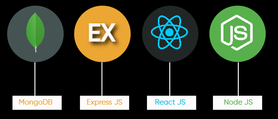

<h1> 📸 Bird Sightings 📸 </h1>

Welcome to Bird Sightings's GitHub repository!

Using our app, you can search for bird sightings either by location, their description or name.

Enjoy the interactive geospatial functionality and cool bird images. Don't forget to leave a comment on the bird you like. (Refer `Setup` section for install instructions)

## Technology

- MongoDB
- Express
- Next.js
- Node JS

## Dataset

The dataset within this repository contains approximately 8 million bird sightings across the United States, showcasing observations of 1,090 different bird species. 

### Data Sources 

- TheCornellLab Feeder Watch Bird Sightings (2021-2023) - `https://feederwatch.org/explore/raw-dataset-requests/`
- Ebird.org scrapped images - `https://ebird.org/explore`
- State Boundaries - `https://www.census.gov/geographies/mapping-files/time-series/geo/carto-boundary-file.html`

## Setup

### Database Setup:
- To create the DB using Database Dump you will need to navigate to `datadump` directory.
- Then you will use command `mongorestore --db flock --restoreDbUsersAndRoles --gzip flock`
- This command will add all the required collections to `flock` DB and MongoDB Users with roles assigned to them.
- You will need to enable the the authorization in `mongod.cfg` and restart the MongoDB Service to add authentication to MongoDB.
- Once the above step is completed you can login to MongoDB using `mongosh --host localhost -u mongoapp -p huMONGOu5 --authenticationDatabase flock` Command.

### Application Setup:
- To start `Flock & Roll` application navigate to `flocknroll` directory.
- Use `npm install` to install all the required dependencies.
- Create `.env.local` File in `flocknroll` directory
    - Add following Environment Variable for your local development:
        - `NEXT_PUBLIC_ENDPOINT_URL=http://localhost:3000`
- Now use `node server.js` to start the application.
- Once all of the above steps are completed you will be able to access application on `http://localhost:3000`

## Application

https://github.com/divyahinge17/BirdSightings/assets/111894899/21640bcc-bd31-4076-b5a7-ec2caf76fab1

