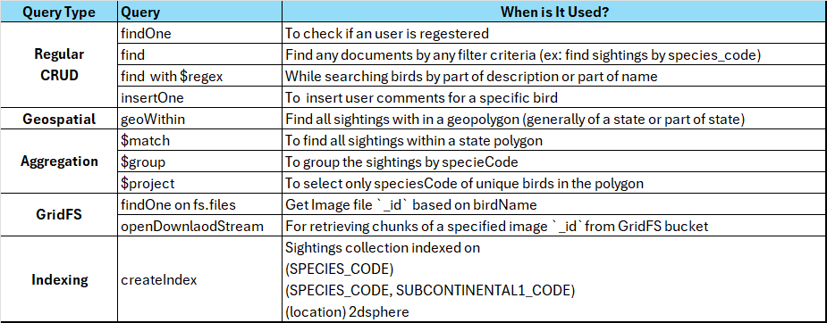
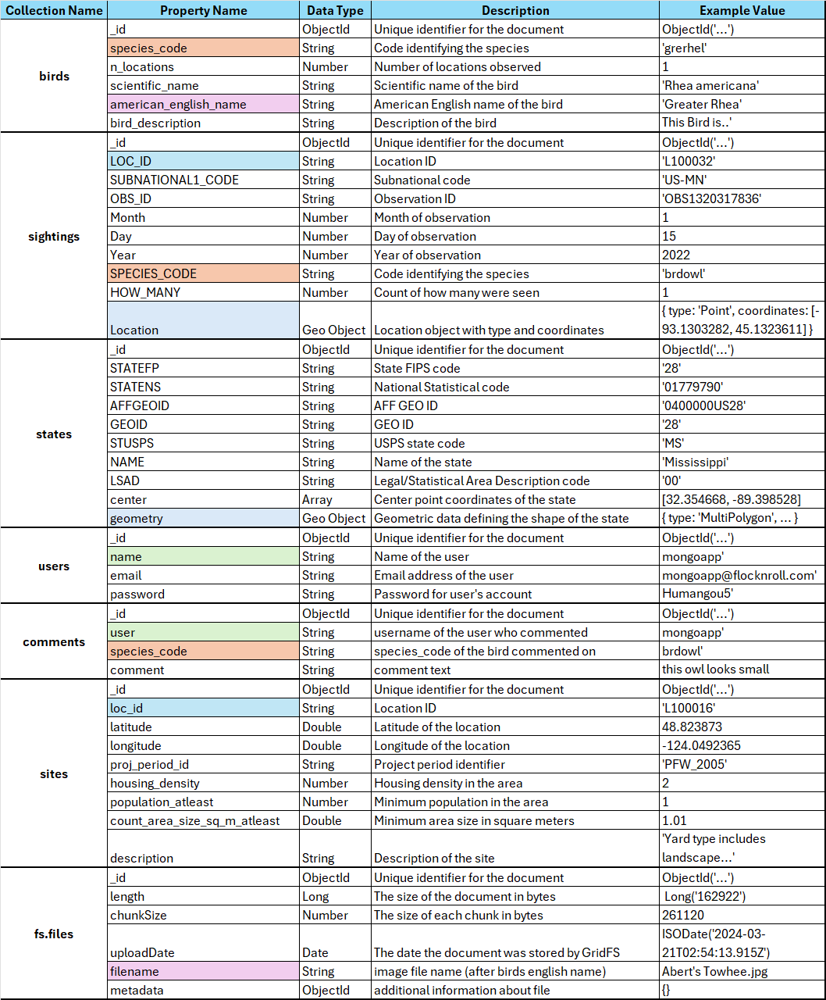

# Flock & Roll:

Welcome to Flock & Roll's GitHub repository!. Using our app, you can search for bird sightings either by location, their description or name.
Enjoy the interactive geospatial functionality and cool bird images. Don't forget to leave a comment on the bird you like. (Refer `Setup` section for install instructions)

## Team Members

- **Poorna Chander Reddy, Puttaparthi** (`@poorna-chander`)
- **Omkar Sandip, Chavan** (`@comkar893`)
- **Divya Dilip, Hinge** (`@divyahinge17`)
- **Onkar Eknath, Shelar** (`@Onkar2102`)

## Dataset Details

### Data Sources 

### Dataset Details 

## Data Processing and Insertion:

Data processing and insertion scripts can be found at `/scripts/data_insertion/`

### Data Processing: 

The following table summarizes the data processing and insertion details. It also covers the challenges faced and how they were mitigated. The script that performs the data insertion is present at `scripts/data_insertion/data_insertion.py`. If not using the dump to restore, you can insert data using `python data_insertion.sh` (required libraries might need to installed using pip) 

### Image Processing:

The following table summarizes the image insertion details. it also covers the challenges faced and how they were mitigated. the script that performs the image insertion is present at `scripts/data_insertion/image_insertion.sh`. If not using the dump to restore, you can insert images using `bash image_insertion.sh` 

## Database and Collection Details:

- DB: flock
- Collections: 
    - sightings : 8394814 documents
    - birds : 1090 documents
    - fs.files : 998 documents (bird images)
    - states : 56 documents (state boundary polygons)
    - sites : 284356 documents
    - users : initially empty and grows 
    - comments : initially empty and grows
- Indexes:
    - sightings -> ({SPECIES_CODE: 1})
    - sightings -> ({SUBNATIONAL1_CODE: 1, SPECIES_CODE: 1});
    - sightings -> ({location: "2dsphere"});

**Note: Detailed `flock` DB Schema and Property descriptions can be found in the last section of this README (MongoDB Schema and Data Dictionary)**

## Mongo Queries:

All the queries for each functionality are present in the express rout functions located at
`flocknroll/expressRoutes/routes.js`

The following table provides an overview of spectrum of mongo queries used and description of functionality for which they were used.

## Mongo Security:

The following diagram depicts the user, roles and collection level privileges that are configured for MongoDB to provide minimal access.

Note: The application accesses the MongoDB as `mongoapp` user and the privileges can be seen in the diagram below.

## Tech Stack:

- Database : MongoDB
- Frontend : Next.js
- Backend : Express
- RuntimeEnv: Node.js

## Interesting App Searches:

- Select Search By Bird 
    - Change radio button to Bird Name (to search by substring in bird name):
        - search for any known or common bird (ex: Owl must give you all kinds of owls, or birds with owl in name)
    - Change radio button to Bird Description (to search by anything from bird description.)
        - Search for `western` and the list shows birds that include `western` in their description.
        - Select a bird (e.g- `Acorn Woodpecker`) and check the map for sightings. Most sightings will be on west coast.
        - Next, search for `smallest` in Bird Details, and the list presents small birds like Hummingbird (e.g- `Calliope Hummingbird`)
        - More suggestions- Search `eastern`, `tallest`, `florida`, `vision`.
        - In Bird Name, search `Barred Owl` to see interesting insight that its sighted mostly on coasts.
        - Similarly, search `Costa's Hummingbird` to see its mostly sighted in around California.
        More suggestions- Search `Anhinga` - found near water, `White-winged Crossbill`, `Golden-cheeked Warbler` - found in Texas exclusively.

- Select Search by Location
    - Select a state (e.g- California) and search for Birds in that state.
    - Search `Costa's Hummingbird` in California.
    - Search `Eurasian Collared-Dove` in Colorado has lots of sightings.
    - Hover over the markings on map to see `Year of Sightings`.

- Comments
    - If you comment for a bird you can view the comment in both Search by Location and Search by Birds flows. This can be seen even after you login from another browser or session as its persisted on mongodb comments collection.

## Bells and Whistles:
- We have built an interactive user interface. especially for the for the geospatial functionality. (ex: plot state geopolygons and make them interactive)
- We have crunched huge volume of data (~8 million records)
- Despite having little knowledge on tech stack (Next.js, Express) when we started, We took up the challenge and we are satisfied with what we have done.
- We have employed software development standards for collaboration and version control (ex: pull requests, dev and prod environments, pair programming, code reviews etc.) 
- We explored practical use-cases related to mongoDB like client side data validation, access management.
- Hosting both express and next.js on same port.
- We feel we did a good job with the README.

## Setup:

### Database Setup:
- To create the DB using Database Dump you will need to navigate to `datadump` directory.
- Then you will use command `mongorestore --db flock --restoreDbUsersAndRoles --gzip flock`
- This command will add all the required collections to `flock` DB and MongoDB Users with roles assigned to them.
- You will need to enable the the authorization in `mongod.cnf` and restart the MongoDB Service to add authentication to MongoDB.
- Once the above step is completed you can login to MongoDB using `mongosh --host localhost -u mongoapp -p huMONGOu5 --authenticationDatabase flock` Command.

### Application Setup:
- To start `Flock & Roll` application navigate to `flocknroll` directory.
- Use `npm install` to install all the required dependencies.
- Create `.env.local` File in `flocknroll` directory
    - Add following Environment Variable for your local development:
        - `NEXT_PUBLIC_ENDPOINT_URL=http://localhost:3000`
- Now use `node server.js` to start the application.
- Once all of the above steps are completed you will be able to access application on `http://localhost:3000`

## MongoDB Schema and Data Dictionary

The table below describes all the collections in the database `flock` with description of each property of documents in the collection.

Note: Similar coloured properties act as connecting keys between collections.

